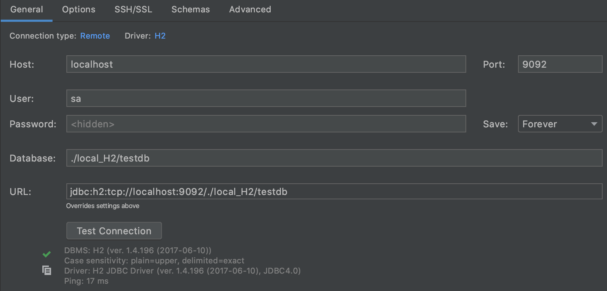

[](https://codeclimate.com/github/devellany/spring-boot-sample/maintainability)
[](https://codecov.io/gh/devellany/spring-boot-sample)
[](http://hits.dwyl.com/devellany/spring-boot-sample)

# Spring boot sample
This repository is "Spring boot" sample code.  
For the purpose of learning "Spring Boot", I studied the login functions required for all sites.


## Uses
### Back-end
- Java 11
- Spring Boot 2.2.6
- Spring Security
- Hibernate
- Querydsl
- H2 database
- Thymeleaf
- Modelmapper
- JUnit
- Lombok

### Front-end
- npm
- jQuery
- Font Awesome
- Bootstrap
- Bootswatch
- Bootsnipp
  - [layout1](https://bootsnipp.com/snippets/7nk08), [layout2](https://bootsnipp.com/snippets/Q0dAX)


## Feature
- Sign up
- Sign in
- Sign out
- Email verification
- Resend email
- Change email

## Add "node_modules"
``` shell
cd src/main/resources
npm install
```
next commit: npm auto-install


## What is directory "local_H2"?
H2 is an in-memory database, so it does not support the remote connection as a default option.  
The "local_H2" directory contains files that support remote connections.  
See the team blog "dico.me" for more details.

Link: [Remote connection for H2 Database](https://dico.me/java/articles/241)

### How to connect "local_h2"?
Notice: Run to Appication for `EmbeddedH2Config`.
```
HOST: localhost
PORT: 9092
USER: sa
PASSWORD: <EMPTY>
DATABASE: ./local_H2/testdb

URL: jdbc:h2:tcp://localhost:9092/./local_H2/testdb
```


## Required setting "application.yml"
``` yaml
server:
  mail:
    host: #SMTP_HOST
    port: #SMTP_PORT
    username: #ID
    password: #PASSWORD
    properties:
      mail:
        smtp:
          auth: false
          timeout: 50000
          starttls:
            enable: true
app:
  host: http://localhost:8082
  title: Devellany's sample
  version: ver.prototype
  help-email: #MAIL_SENDER_ADDRESS
  token-available-period: 60

```


## Reference material
- Web application development with Spring and JPA, Keesun Baik [Link](https://www.inflearn.com/course/%EC%8A%A4%ED%94%84%EB%A7%81-JPA-%EC%9B%B9%EC%95%B1)
- Spring data JPA, Keesun Baik [Link](https://www.inflearn.com/course/%EC%8A%A4%ED%94%84%EB%A7%81-%EB%8D%B0%EC%9D%B4%ED%84%B0-jpa)
- Spring boot concept and use, Keesun Baik [Link](https://www.inflearn.com/course/%EC%8A%A4%ED%94%84%EB%A7%81%EB%B6%80%ED%8A%B8)
- Java ORM standard JPA programming, Younghan Kim [Link](http://www.kyobobook.co.kr/product/detailViewKor.laf?barcode=9788960777330)
- Reference documents
- StackOverflow

## License
MIT License.